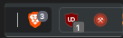

# 😢 Troubleshooting

Before we even start discussing ANY troubleshooting, if you are having difficulty with a transaction to buy or sell $RAFL failing - PLEASE INCREASE YOUR SLIPPAGE as taxes are 2.5% - [SEE HERE](../tokenomics/fees-taxes.md)⬅️

If any of the following are happening to you:

1. Website itself doesn't load
2. Website loads, but the data doesn't
3. The wallet is not showing you a window to sign a transaction
4. You have a white screen

Then chances are you're running into a networking issue. This could happen for any reason, but most often happens because your internet provider OR your VPN blocks some important IP address that we need for the app to work.

## Troubleshooting🆘

Try the following options (from easiest to hardest):

1. Hard refresh your browser window (CMD+SHIFT+R on Mac / CTRL+SHIFT+R on Windows)
2. Try incognito mode
3. Try a different browser
   1. Especially if you're using Brave - Brave has all kinds of funky privacy stuff that could be blocking connection to our servers
4. Try Disabling privacy focused extensions like these

<figure><figcaption></figcaption></figure>

5. If you're using a VPN, try turning it OFF
6. If you're not using a VPN, try turning it ON. Try a few different countries, like the UK and the US
7. If nothing helps try installing a different VPN and trying different countries there

If you've tried all of the above and nothing worked, please feel free to join us on the [Official RAFL Telegram](https://t.me/RAFLSecurityVault) and we would love to help you out!
