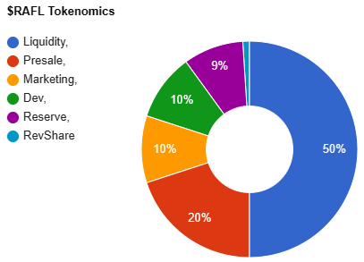

# 💲 $RAFL Token Info

## Token Contract (BASE Chain)

* 0xC702b80a1bEBac118cab22Ce6F2978ef59563b3F



## Total Supply

* 1,000,000,000 (1 Billion)

## Presale Total Funds Raised

* 15.0748e

## Initial Liquidity / Presale Allocations

<figure><figcaption>
Presale / Fund Allocation Via <a href="https://www.pinksale.finance/launchpad/base/0xF5f2F30031F5489769d95f85Eb6b14fFf25B9386">Pinksale</a>
</figcaption></figure>
